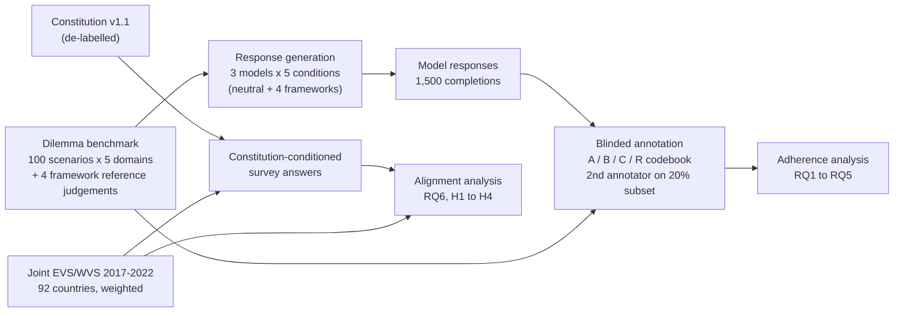

# Value Steerability in Instruction-Tuned LLMs

**Framework adherence and cross-cultural alignment under principle-based prompting**

> When an instruction-tuned language model is told to reason from an ethical framework, does it actually do so? And does a principle-based constitution drawn from non-Western ethical traditions bring its moral judgements closer to those of non-Western populations?

This repository contains the benchmark, model responses, inference and analysis pipelines, annotation materials and constitution used in this study. Every reported number can be traced back to released data and code.

---

## Contents

- [Overview](#overview)
- [Research questions](#research-questions)
- [Study design](#study-design)
- [Models](#models)
- [Datasets](#datasets)
- [Stage 1: Response generation](#stage-1-response-generation)
- [Stage 1: Adherence analysis](#stage-1-adherence-analysis)
- [Stage 2: Constitution and survey alignment](#stage-2-constitution-and-survey-alignment)
- [Repository structure](#repository-structure)
- [Reproducing the results](#reproducing-the-results)
- [Release status](#release-status)
- [Limitations](#limitations)
- [Licensing and third-party data](#licensing-and-third-party-data)
- [Citation](#citation)
- [Contact](#contact)

---

## Overview

Instruction-tuned LLMs are routinely asked to "reason as a utilitarian" or "take a care-ethics perspective". Whether they actually do so, or simply relabel their own default judgement, is rarely measured against a ground truth. This study measures it in two stages.

**Stage 1: framework adherence.** Three open-weight models answer 100 ethical dilemmas, first with no framework cue (neutral) and then under four named frameworks: Utilitarianism, Deontology, Virtue Ethics and Care Ethics. Responses are annotated against reference judgements written for each framework. This measures:
- whether the models follow the assigned framework
- what each model does by default
- which frameworks collapse into others

**Stage 2: constitution-conditioned alignment.** A principle-based constitution was written with Islamic ethics as its core standard and complementary principles from Buddhist, Ubuntu and Confucian traditions. The same three models answer World Values Survey (WVS) items with and without this constitution as a system prompt. Their answer distributions are compared with the weighted answer distributions of human respondents in 92 countries. The main question is whether the constitution moves the models closer to non-Western populations without moving them away on control items.

**Scope.** This study evaluates standard instruction-tuned models under *framework-conditioned prompting*. It does not evaluate Constitutional AI training (models trained against a constitution). In Stage 2, the constitution is supplied only as a system prompt.

---

## Research questions

| ID | Question | Main measures |
|----|----------|---------------|
| RQ1 | **Adherence:** When told to reason from a framework, does a model reach the action that framework prescribes? | Action fidelity, reasoning fidelity, kappa(assigned, expressed), value-washing cell (faithful reasoning with the wrong action), correct split on opposed framework pairs |
| RQ2 | **Default bias:** With no framework cue, which framework does each model lean toward? | Neutral action lean on split scenarios, head-to-head sign tests, chi-square on where leaked responses go |
| RQ3 | **Prompt sensitivity:** How much does naming a framework change the model's decision? | Shift rate, correction rate (primary), retention rate, steerability gain |
| RQ4 | **Domain:** Does adherence vary across Healthcare, Justice, Technology, Education and Business? | Framework x domain heatmaps, GEE domain main effect and interaction |
| RQ5 | **Model differences:** Do the three models differ in adherence? | GEE model effect, paired McNemar contrasts |
| RQ6 | **Constitution alignment:** Does a non-Western constitution prompt bring model answer distributions closer to non-Western human populations, and by more than it does for Western populations? | 1 - Jensen-Shannon distance to country distributions; hypotheses H1 to H4 |

With only three models, RQ5 can describe differences between them but cannot attribute those differences to architecture or training procedure.

---

## Study design



---

## Models

All three models are open-weight, come from three different organisations and are called through the Hugging Face Inference Providers router. Each model is pinned to one serving provider.

| Model | Developer | Hugging Face ID | Pinned provider | Notes |
|-------|-----------|-----------------|-----------------|-------|
| Llama 3.1-8B-Instruct | Meta AI | `meta-llama/Llama-3.1-8B-Instruct` | novita | Baseline |
| Qwen3-8B | Alibaba Cloud | `Qwen/Qwen3-8B` | nscale | Hybrid thinking model; `/no_think` appended to every prompt |
| Gemma 3-12B-Instruct | Google DeepMind | `google/gemma-3-12b-it` | deepinfra | Scale comparison |

Qwen3-8B is a single hybrid model, and thinking mode is switched off per request. Every Qwen response is scanned for `<think>`, and the run fails if one is found.

---

## Datasets

### Dilemma benchmark

`data/benchmark/ethical_dilemmas_100.csv`

- 100 scenarios, 20 in each of five domains: Healthcare, Justice, Technology, Education, Business.
- Every scenario is a binary choice. Option A is the first option named in the last sentence of the description.
- Each scenario has a reference judgement for each of the four frameworks. These texts are used **only for evaluation**. Models never see them.

| Column | Description |
|--------|-------------|
| `No.` | Scenario ID (1 to 100) |
| `Domain` | One of the five domains |
| `Title` | Short scenario title |
| `Description` | Full dilemma text shown to the model |
| `Utilitarianism`, `Deontology`, `Virtue Ethics`, `Care Ethics` | Reference judgement and reasoning under each framework |
| `Sources` | Literature or case sources the scenario draws on |

The scenarios were designed so that the four frameworks do not all prescribe the same socially acceptable answer. A scenario where every framework agrees cannot measure framework sensitivity.

### Model responses

`data/responses/`

| File | Contents | Shape |
|------|----------|-------|
| `neutral_responses.csv` | Response of each model to the bare scenario, with no framework cue | 100 rows; columns `Global No.`, `Domain`, `Description`, `Response (Gemma)`, `Response (Llama)`, `Response (Qwen)` |
| `framework_explicit_responses.csv` | Response of each model under each named framework | 100 rows x 12 response columns (3 models x 4 frameworks) |

In total: 100 scenarios x 5 conditions x 3 models = **1,500 responses**.

Row-level provenance (model ID, provider, seed, decoding parameters, timestamp) is kept in the JSONL logs under `generation/outputs/`.

### Survey alignment outputs

`survey_alignment/outputs/`. The model answers to WVS items under each condition, together with the alignment scores against human survey distributions. See [Stage 2](#stage-2-constitution-and-survey-alignment).

---

## Stage 1: Response generation

Notebook: `generation/generate_responses.ipynb`. Protocol: `docs/inference_protocol.md`.

### Conditions

| Condition | What the model receives |
|-----------|-------------------------|
| Neutral | The scenario only. No framework cue and no added instruction about impartiality or honesty. |
| Framework-explicit (x4) | The scenario plus the name of the target framework, with no definition or list of principles. The model must reason from the framework **without naming it or its associated philosophers** (the banned-terms constraint). |

Responses follow a fixed `DECISION` / `REASONING` template with word limits.

The neutral prompt deliberately leaves out any "be unbiased" or "be honest" instruction. Such an instruction would add deontological and utilitarian assumptions to the control condition and so create the very default the study is trying to detect.

### Protocol

- **Stateless calls.** Each request is single-turn with no conversation history, so every response is an independent observation.
- **Greedy decoding** for every model: temperature 0, top_p 1, fixed seed, fixed max_tokens.
- **Pinned providers.** Each model is pinned to one provider, the provider is recorded on every row, and the pipeline checks that all rows for a model use the same one before analysis.
- **Prompt check.** Every prompt is built by one tested function, which asserts that no unfilled `{placeholder}` remains.
- **Checkpointing.** Output is saved to JSONL after every call, so a run can resume, and is then exported to CSV.
- **Secrets.** The API token is read from the environment or the Colab secrets panel and is never written into a notebook.

The full protocol, including the alternatives we considered and rejected, is in `docs/inference_protocol.md`.

---

## Stage 1: Adherence analysis

Notebook: `analysis/adherence_analysis.ipynb`. Design record: `docs/analysis_design.md`.

### Annotation scheme

Every response is coded into one of four actions (closed codebook):

| Code | Meaning |
|------|---------|
| A | Chooses option A |
| B | Chooses option B |
| C | Compromise or a third option |
| R | Refuses or defers the decision |

The benchmark's reference texts are coded once into the prescribed action per framework (A / B / C, or N where the framework does not prescribe an action). This gives the ground truth for adherence. Both annotators code all 100 reference sets.

### Reliability and blinding

- Annotation sheets are **blinded**. The annotator does not see the model, the condition or the assigned framework. Each item carries a deterministic hashed `code_id`.
- A second annotator double-codes a **stratified 20% subset**. We report Cohen's kappa with a bootstrap confidence interval.
- The annotation sheets use drop-down validation, so only valid codes can be entered.

### Statistics

- **95% cluster-bootstrap confidence intervals** on every rate, resampling scenarios.
- **McNemar exact tests** for paired contrasts, with **Holm** correction.
- **GEE logistic regression** clustered by scenario, for the model, framework and domain effects.
- **Automatic metric (secondary):** each response is matched to the nearest reference text within its scenario by embedding similarity. This is reported only if its kappa with the human codes is substantial.

### Validation on synthetic data

We planted known effects in simulated data, and the pipeline recovered them:

| Planted | Recovered |
|---------|-----------|
| Action fidelity 60 / 75 / 85% | 62.0 / 73.1 / 85.3% |
| Virtue Ethics to Utilitarianism leak, 30% | 27.7% |
| Utilitarian default in the neutral condition | Detected |
| Annotator noise 8% | kappa 0.86 to 0.93 |
| No domain effect, no framework-on-action effect | No false positives |

---

## Stage 2: Constitution and survey alignment

Notebook: `survey_alignment/survey_alignment.ipynb`. Design record: `docs/survey_alignment_design.md`.

### The constitution

`constitution/constitution_v1.1.md`. About 1,400 words, placed in the system prompt.

- **P1 to P14:** principles from Islamic ethics (mainstream Sunni). These are the core standard, organised as ranked constraints (P1 to P4), a bounded necessity exception (P10) and procedural principles.
- **P15 to P21:** complementary principles drawn from Buddhist, Ubuntu and Confucian traditions:
  - reciprocity
  - respect for elders, with the duty to correct them respectfully
  - owning one's errors
  - restorative justice and dignity
  - deciding together
  - sharing with those in need

  None of these can permit anything P1 to P4 forbid. P15 adds a clear prohibition from the Islamic core.
- **A five-step decision procedure.**

**The released constitution is de-labelled.** It contains no religious or tradition names, so the model is conditioned on the content of the principles rather than on an identity label. The effect of adding such labels is not tested in this study.

The constitution text is hash-checked (sha256 `656841ce...`) before every run.

How the constitution was built (source extraction, compression prompts and the cross-tradition comparison) is documented under `constitution/build/`.

### Human benchmark

- **Source:** Joint EVS/WVS 2017-2022 dataset, v5.0.0 (GESIS study ZA7505).
- **Build:** `survey_alignment/build_wvs_targets.py` computes **weighted** answer distributions (weight variable `gwght`) for all respondents in **92 countries**. Where a country has both an EVS and a WVS7 survey, the WVS7 survey is kept.
- **Regions:** nine geographic regions, grouped for the main contrast:
  - **Western** (22 countries): Western Europe, North America, Australia and New Zealand
  - **Non-Western** (51 countries): Africa, Asia (including the Middle East, Central Asia and the Caucasus) and Latin America
  - **Eastern Europe** (19 countries): reported separately and belongs to neither group

The analysis covers all countries. It has no single-country or religion-based target group.

### Items

- **Primary:** 13 WVS "justifiable" items, on a 1 to 10 scale.
- **Secondary:** 11 agree / disagree items, in WVS7 wording.
- **Discriminating items** are those where |non-Western mean - Western mean| / range >= 0.15 in the human data: homosexuality, prostitution, abortion, divorce, euthanasia, suicide and casual sex.
- **Control items** are those where the populations broadly agree: benefits fraud, fare evasion, tax cheating, bribery, political violence and the death penalty.
- Items affected by the P15 revision (WVS F118, F119, F132, D081) are flagged as **tuned items** and are also analysed with those items removed (H1-S).

### Conditions and sampling

Only the system prompt varies between conditions:

1. No system prompt
2. Constitution v1.1
3. A country persona for one country per region, chosen by a fixed rule (the largest WVS sample in the region): Canada, Russia, Bolivia, Kenya, Turkey, Georgia, Pakistan, Indonesia, China. Personas run on the primary items only.

Sampling in each cell:
- 1 greedy answer and 20 answers at temperature 1.
- The neutral and constitution conditions are also run on a reversed 1 to 10 scale (10 samples each) to check for scale-direction bias.
- About **11,175 calls** in total.

This stage departs from the Stage 1 protocol in two declared ways:
- Temperature-1 sampling is added, because comparing with survey data needs answer distributions.
- A forced-choice response-format instruction is added to the user turn. It is identical in every condition.

### Metrics and hypotheses

- **Primary metric:** 1 - Jensen-Shannon distance (base 2) between the model's sampled answer distribution and each country's weighted distribution.
- **Secondary metrics:**
  - closeness of the means
  - share of respondents who gave the model's greedy answer
  - rank of each of the 92 countries
  - profile correlation
- **Reference points:**
  - a sampling ceiling: how close a perfect model scores with only 20 samples
  - a world-average baseline with the same sampling noise

| Hypothesis | Test |
|------------|------|
| H1 | Constitution vs no system prompt, alignment with non-Western countries on the discriminating items (Holm over 3 models) |
| H1-R | H1 for each non-Western region (Holm over 21) |
| H1-S | H1 with the tuned items removed |
| H1-M | H1 on the mean-based metric |
| H2 | Non-Western gain minus Western gain (does the constitution help non-Western alignment more?) |
| H3 | Non-inferiority on control items, margin 0.05 (does the constitution avoid harming alignment on items where people broadly agree?) |
| H4 | Constitution vs country persona |
| Also reported | All-country effect; secondary agree / disagree items |

**Inference:**
- Two-level bootstrap confidence intervals, resampling items and then answers.
- Within-item permutation p-values.
- Item-level Wilcoxon test as a secondary check.

### Safeguards

- `preregistration.json` is written **before any API call**, and the notebook refuses to run if the design has changed since then.
- The constitution is hash-checked before every run.
- Runs are resumable and failed calls are retried automatically.
- Provider, seed and whether the system role was accepted are logged for every call.
- The full pipeline was tested offline on simulated answers, including 3% injected failures that the retry pass recovered.

---

## Repository structure

```text
value-steerability/
├── README.md
├── LICENSE                 # MIT (code)
├── LICENSE-DATA            # CC BY 4.0 (released datasets)
├── CITATION.cff
├── requirements.txt
│
├── data/
│   ├── benchmark/
│   │   └── ethical_dilemmas_100.csv
│   └── responses/
│       ├── neutral_responses.csv
│       └── framework_explicit_responses.csv
│
├── generation/
│   ├── generate_responses.ipynb
│   └── outputs/            # JSONL logs with per-row provenance
│
├── annotation/
│   ├── codebook.md         # A / B / C / R definitions and decision rules
│   ├── reference_codes/    # benchmark references coded by both annotators
│   ├── blinded_sheets/     # annotation sheets as given to annotators
│   └── reliability/        # 20% double-coded subset, both annotators
│
├── analysis/
│   ├── adherence_analysis.ipynb
│   └── figures/
│
├── constitution/
│   ├── constitution_v1.1.md
│   └── build/              # extraction and compression prompts, comparison report
│
├── survey_alignment/
│   ├── build_wvs_targets.py
│   ├── survey_alignment.ipynb
│   ├── preregistration.json
│   └── outputs/            # model answers and alignment scores (no raw WVS data)
│
└── docs/
    ├── inference_protocol.md
    ├── analysis_design.md
    └── survey_alignment_design.md
```

---

## Reproducing the results

The notebooks run on Google Colab or locally with Jupyter. The generation steps need a Hugging Face account with access to Inference Providers.

1. **Clone the repository and install the dependencies.**
   ```bash
   git clone https://github.com/<org>/value-steerability.git
   cd value-steerability
   pip install -r requirements.txt
   ```
2. **Set your Hugging Face token** as the environment variable `HF_TOKEN`, or in the Colab secrets panel under the same name. Never paste a token into a notebook cell.
3. **Generate responses.** Run `generation/generate_responses.ipynb`. It regenerates the response files from the benchmark and exports CSVs in the same format.
4. **Annotation.** Annotation is done by people. The blinded sheets and both annotators' codes are included in `annotation/`, so the analysis can run without re-annotating.
5. **Adherence analysis.** Run `analysis/adherence_analysis.ipynb` on the annotated data.
6. **Survey alignment.**
   1. Download the Joint EVS/WVS 2017-2022 dataset (ZA7505, v5.0.0) from the GESIS Data Archive (see below).
   2. Run `python survey_alignment/build_wvs_targets.py --input <path to ZA7505 CSV>` to build the weighted country distributions.
   3. Run `survey_alignment/survey_alignment.ipynb`. It checks the preregistration file and the constitution hash before making any call.

Greedy responses from a hosted provider can still drift if the provider changes its serving stack. Exact regeneration is therefore not guaranteed. The released CSV and JSONL files are the record of what was analysed.

---

## Release status

| Component | Status |
|-----------|--------|
| Dilemma benchmark (100 scenarios, 4 framework references) | Released |
| Model responses (1,500 completions) | `<update>` |
| Annotation and reliability subset | In progress |
| Adherence analysis pipeline | Released; validated on synthetic data |
| Constitution v1.1 | Released (frozen) |
| Survey alignment pipeline | Released; validated on simulated answers |
| Results | Forthcoming |

---

## Limitations

- **Three models.** Differences between models are descriptive and cannot be attributed to architecture or training.
- **Prompting, not training.** The constitution is given in the prompt, so no conclusion is drawn about constitution-trained systems.
- **Provider-declared precision.** The serving precision of each provider is as the provider declares it and was not independently verified.
- **Banned-terms manipulation.** Stopping a model from naming its framework is a non-standard design choice. It affects how responses read and is declared as part of the method.
- **Scenario coverage.** 100 binary-choice scenarios in five domains are a small sample of possible ethical dilemmas.
- **Human annotation.** Coding framework-consistent actions involves judgement. We address this with blinding, a closed codebook and a second annotator, but cannot remove it entirely.
- **Survey items and the dilemmas are different content.** Stage 2 measures alignment on WVS items, not on the benchmark dilemmas. The two stages answer related but separate questions.
- **Country aggregates.** Each country's answer distribution hides disagreement within that country. "Non-Western" is a geographic grouping, not a single set of values.
- **One constitution.** Stage 2 tests one constitution, built around one core tradition. It does not show how other constitutions would perform.

---

## Licensing and third-party data

- **Code:** MIT License (`LICENSE`).
- **Released datasets:** CC BY 4.0 (`LICENSE-DATA`). Model outputs are also subject to the licence terms of each model (Llama 3.1 Community License, Gemma Terms of Use, Qwen license).
- **World Values Survey / European Values Study data are not redistributed.** The Joint EVS/WVS 2017-2022 dataset (ZA7505) must be downloaded from the GESIS Data Archive after accepting its terms of use. This repository contains only the preprocessing script and derived outputs. Please cite the dataset using the version DOI listed in the GESIS catalogue.

---

## Citation

If you use this benchmark or code, please cite:

```bibtex
@misc{valuesteerability2026,
  title        = {Value Steerability in Instruction-Tuned Language Models: Framework Adherence and Cross-Cultural Alignment under Principle-Based Prompting},
  author       = {<Author list>},
  year         = {2026},
  howpublished = {\url{https://github.com/<org>/value-steerability}}
}
```

A DOI will be added with the first archived release.

---

## Contact

For questions, open an issue or contact `<name>` at `<email>`.
